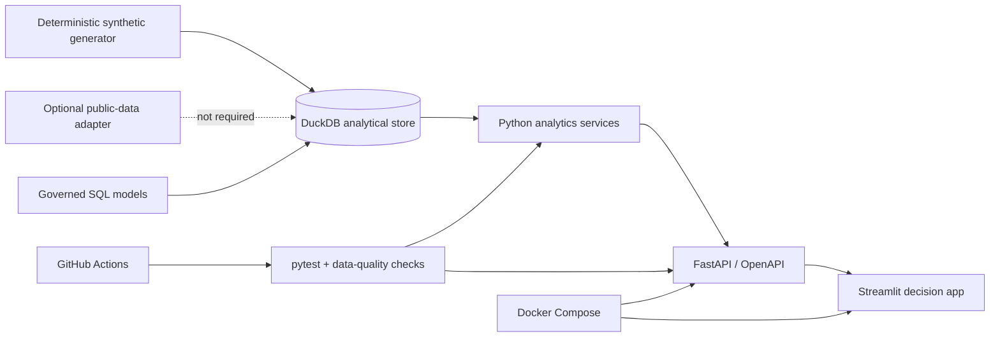

# GrowthLab — User Growth Analytics & Experimentation Workbench

[中文说明](README_zh.md) · [GROWTH methodology](docs/growth-methodology.md) · [Metric dictionary](docs/metric-dictionary.md) · [Experiment playbook](docs/experimentation-guide.md) · [Interview guide](docs/interview-guide.md)

GrowthLab is a privacy-safe, end-to-end analytics portfolio project for user-growth roles. It turns two common growth problems—referral acquisition and new-user retention—into a reproducible decision system with governed metrics, SQL, a DuckDB analytical store, a FastAPI service, a nine-page Streamlit application, statistical experiment checks, automated tests, Docker, and CI.

> Portfolio reconstruction only. Every user, campaign, amount, metric value, and experiment result in the public demo is deterministic synthetic or normalized data. The repository contains no employer data, proprietary code, production credentials, or confidential identifiers. See [DISCLAIMER.md](DISCLAIMER.md).

## Why this project is useful

Many analytics portfolios stop at charts. GrowthLab demonstrates the harder parts of the job:

- translating a top-level growth objective into a governed metric tree;
- diagnosing a funnel change before recommending a product intervention;
- separating retention mix shift from within-segment performance;
- distinguishing correlation from causal evidence;
- designing A/A and A/B experiments before evaluating results;
- checking stable assignment, SRM, segment balance, Simpson's paradox, confidence intervals, statistical significance, business significance, and guardrails;
- making unit economics explicit by separating `LTV/CAC` from net ROI;
- exposing the same logic through SQL, Python services, an API, and an executive-facing application;
- making every result reproducible with tests, data-quality checks, Docker, and CI.

## Product tour

The application contains nine decision-oriented pages:

1. **Executive overview** — normalized DAU target progress, robust anomaly triage, growth-source contribution, metric tree, and KPIs.
2. **GROWTH methodology** — a six-gate personal operating system, six-level evidence ladder, authoritative sources, and claim boundaries.
3. **Reusable workbench** — problem router, editable aggregate funnel diagnosis, editable Mix-Shift decomposition, and decision memo.
4. **Data quality & governance** — automated integrity gates, metric contracts, reproducibility, and privacy boundary.
5. **Referral funnel** — version comparison, conversion diagnosis, and action log.
6. **ROI & LTV** — 30-day value, CAC, LTV/CAC, net ROI, benchmark, and sensitivity analysis.
7. **Retention diagnostics** — cohort heatmap, exact-day/window retention, segments, Mix-Shift decomposition, and onboarding funnel.
8. **Feature analysis** — benchmark-user penetration analysis with an explicit correlation/causality boundary.
9. **Experiment center** — pre-registration → hash assignment → A/A → SRM/balance → A/B → decision.

## System architecture



## Experiment operating procedure

GrowthLab implements a decision gate rather than a stand-alone p-value calculator:

```text
objective and strategy
  → primary, business, guardrail, and supporting metrics
  → baseline + MDE + alpha + power + full-cycle duration
  → stable user-ID hash assignment
  → A/A instrumentation and allocation validation
  → SRM and channel/city/device balance checks
  → fixed-horizon A/B execution
  → two-proportion Z-test + confidence interval
  → statistical significance + business significance + guardrail
  → ship / iterate / stop with an auditable reason
```

The default demo asks whether a simplified invitation screen can improve invite click-through. It includes novelty-effect monitoring, network-interference guidance, no-peeking discipline, segment-level reporting, and DID/PSM notes for cases where randomization is infeasible. See the [experiment playbook](docs/experimentation-guide.md).

The broader analytical workflow is documented in [GROWTH Decision OS](docs/growth-methodology.md). It connects established work from Google Research, Microsoft Research, Kitagawa's rate-decomposition tradition, official cohort definitions, and network-interference research while documenting where each method stops supporting stronger claims.

## Quick start

### Docker (recommended)

```bash
docker compose up --build
```

Then open:

- Streamlit application: `http://localhost:8501`
- FastAPI documentation: `http://localhost:8000/docs`
- Health endpoint: `http://localhost:8000/health`

### Local Python

Python 3.10–3.13 is supported.

```bash
python -m venv .venv
# Windows: .venv\Scripts\activate
# macOS/Linux: source .venv/bin/activate
python -m pip install -e ".[dev]"
python -m scripts.generate_demo_data
uvicorn backend.main:app --reload
```

In a second terminal:

```bash
streamlit run frontend/streamlit_app.py
```

### Tests and quality gates

```bash
pytest --cov=analytics --cov=backend --cov-report=term-missing
ruff check .
```

The test suite covers statistical gold cases, sample-size behavior, hash stability, SRM, A/A behavior, retention definitions, mix-shift conservation, ROI identities, funnel invariants, data generation, and API contracts.

## Data strategy

The default dataset is generated locally from a fixed seed and contains only fictional IDs and normalized values. This provides a safe, one-command demo while keeping cohorts, funnel paths, segments, treatment assignment, seasonality, and experiment outcomes internally consistent.

The project also documents an optional route to Google's public, obfuscated GA4 sample. It is not required to run GrowthLab, and third-party raw data is not committed. See [docs/data-card.md](docs/data-card.md).

## Repository map

```text
analytics/     Metric, funnel, retention, ROI, decomposition, experiment logic
backend/       FastAPI routes, schemas, database access, service orchestration
frontend/      Nine-page Streamlit analytics application
sql/           Warehouse schema and governed analytical queries
scripts/       Deterministic demo-data generation and utility commands
tests/         Unit, statistical, integration, API, and quality tests
docs/          Case studies, metric dictionary, data card, and interview guide
.github/       Continuous-integration workflow
```

## Analytical case studies

- [Referral growth: funnel diagnosis, UI iteration, experiment design, and economics](docs/case-study-referral.md)
- [New-user retention: segmentation, onboarding exclusion, feature hypothesis, and causal validation](docs/case-study-retention.md)

These are synthetic portfolio reconstructions of general analytical patterns. They are deliberately written as problem → evidence → decision → limitation, not as unverifiable claims about a specific employer.

## Engineering decisions

- **DuckDB** keeps the demo portable while preserving warehouse-style SQL.
- **FastAPI** creates a typed contract between analytical logic and presentation.
- **Streamlit** keeps attention on business decisions while still showing full-stack delivery.
- **Deterministic generation** makes every chart and test reproducible.
- **Normalized value units** prevent accidental disclosure of real commercial inputs.
- **Fixed-horizon inference** is the default; continuous monitoring is for guardrail safety, not optional stopping.

Detailed trade-offs are recorded in [docs/decisions.md](docs/decisions.md).

## License

Code is released under the [MIT License](LICENSE). Documentation and synthetic outputs are provided for learning and portfolio demonstration; third-party data remains subject to its original terms.
