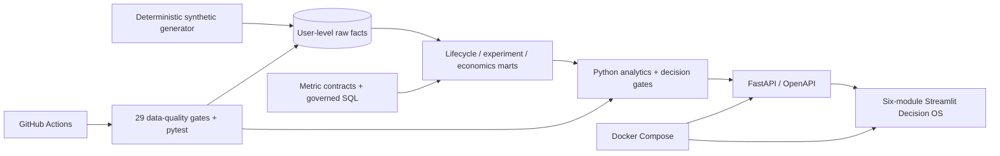

# GrowthLab — Quality-Adjusted Growth Decision OS

[](https://github.com/liu-XI71/growthlab-user-growth-analytics/actions/workflows/ci.yml)

[中文说明](README_zh.md) · [GROWTH methodology](docs/growth-methodology.md) · [Metric dictionary](docs/metric-dictionary.md) · [Experiment playbook](docs/experimentation-guide.md) · [Interview guide](docs/interview-guide.md)

GrowthLab is a privacy-safe, full-stack analytics portfolio project for user-growth, product-analytics, and business-analytics roles. It connects referral acquisition and new-user retention into one auditable lifecycle—assignment → exposure → click → acquired user → activity → retention → value → variable cost—and turns it into a reproducible decision system built with governed SQL, DuckDB, Python analytics, FastAPI, a six-module Streamlit application, automated tests, Docker, and CI.

> Portfolio reconstruction only. Every user, campaign, amount, metric value, and experiment result in the public demo is deterministic synthetic or normalized data. The repository contains no employer data, proprietary code, production credentials, or confidential identifiers. See [DISCLAIMER.md](DISCLAIMER.md).

## Why this project is useful

Many analytics portfolios stop at charts. GrowthLab demonstrates the harder parts of the job:

- **One lifecycle, one grain:** acquired users are real rows reused by activity, retention, value, and cost facts—not unrelated dashboard totals.
- **Decision-first metrics:** every metric has a definition, eligibility rule, denominator, observation window, owner, SQL lineage, and claim boundary.
- **Diagnosis before intervention:** funnel, path, cohort, and Mix-Shift evidence localize a problem before a product hypothesis is proposed.
- **Causal discipline:** assignment-based ITT is the default decision estimand; exposed/triggered results are explicitly diagnostic and selection-biased.
- **Experiment health before p-values:** stable hash assignment, A/A, SRM, pre-treatment SMD, fixed horizon, maturity, multiplicity, business MDE, and guardrails are independent gates.
- **Quality-adjusted growth:** the platform reports incremental D7 retained users and incremental 30-day contribution per 10,000 assigned users, including all modeled variable costs.
- **Economics without denominator mixing:** average `LTV/CAC`, incremental contribution, cost per incremental retained user, uncertainty, and budget scenarios remain separate contracts.
- **Auditable delivery:** the same logic is encoded in SQL marts, Python services, typed APIs, decision cards, data-quality checks, tests, Docker, and CI.

## Reproducible canonical demo

The default seed-42 profile contains 100,000 synthetic users. It is designed to recover a known data-generating truth: the treatment changes invitation-page usability and therefore acquisition quantity, while downstream retention, value, incentive, and variable-cost policies are identical across arms.

| Fixed-horizon result | Canonical synthetic benchmark |
| --- | ---: |
| Data-quality gates | 29 / 29 passed |
| Invitation click-through | 16.50% → 21.79% (+5.29 pp) |
| Incremental D7 retained / 10k assigned | 19.48 (95% CI 8.00–30.96) |
| Incremental D1–7 active / 10k assigned | 72.19 (95% CI 49.68–94.71) |
| Incremental Contribution30 / 10k assigned | 574.22 (bootstrap 95% CI 364.85–776.90) |
| Pre-registered decision gates | 12 / 12 passed → `SHIP_WITH_MONITORING` |

These are deterministic portfolio-demo results, not employer achievements or forecasts. Small samples intentionally produce `DO_NOT_SHIP` until sample, duration, maturity, quality, and economic gates are satisfied.

## Six decision modules

1. **Executive decision cockpit** — a 60-second answer and three-minute guided flow from normalized DAU gap to an auditable ship/no-ship decision.
2. **Growth lifecycle** — one acquisition-to-value Sankey/funnel, mature cohort denominators, acquisition-quality matrix, and descriptive-versus-causal boundaries.
3. **Investigation studio** — path evidence, version breakpoints, device Mix-Shift decomposition, Simpson-risk checks, and fact → interpretation → hypothesis → action → limitation writing.
4. **Experiment & causal lab** — pre-registration, assignment/exposure distinction, A/A, SRM, SMD, weekly durability, ITT and triggered estimates, segment confidence intervals, multiplicity, and decision gates.
5. **Growth economics** — average unit economics separated from incremental economics, bootstrap uncertainty, cost per incremental D7 retained user, break-even and budget scenarios.
6. **Decision governance** — metric contracts and SQL lineage, evidence grades, data-quality status, decision cards, owners, monitoring rules, and rollback conditions.


Additional verified screens: [lifecycle](docs/assets/growthlab-lifecycle.png) · [investigation](docs/assets/growthlab-investigation.png) · [experiment](docs/assets/growthlab-experiment.png) · [economics](docs/assets/growthlab-economics.png) · [governance](docs/assets/growthlab-governance.png)

## System architecture



## Experiment operating procedure

GrowthLab implements a decision gate rather than a stand-alone p-value calculator:

```text
objective and strategy
  → primary, business, guardrail, and supporting metrics
  → baseline + MDE + alpha + power + full-cycle duration
  → stable user-ID hash assignment + assignment/exposure logging
  → A/A instrumentation and metric-pipeline validation
  → explicit SRM + pre-treatment channel/city/device SMD checks
  → fixed-horizon A/B execution
  → ITT estimate + confidence interval + pre-specified segment/multiplicity policy
  → sample + duration + maturity + quality + statistical + business + guardrail gates
  → incremental retained users + Contribution30 + economics gate
  → ship with monitoring / iterate / stop with an auditable reason
```

The default demo asks whether a simplified invitation screen can improve invite click-through and, through that mechanism, create retained users and positive incremental contribution. It includes novelty-effect monitoring, network-interference guidance, no-peeking discipline, segment uncertainty, multiplicity boundaries, and DID/PSM notes for cases where randomization is infeasible. See the [experiment playbook](docs/experimentation-guide.md).

The broader analytical workflow is documented in [GROWTH Decision OS](docs/growth-methodology.md). It connects established work from Google Research, Microsoft Research, Kitagawa's rate-decomposition tradition, official cohort definitions, and network-interference research while documenting where each method stops supporting stronger claims.

## Quick start

### Docker (recommended)

```bash
docker compose up --build
```

On first boot, the backend generates the canonical 100,000-user database. Allow roughly 3–4 minutes on a typical laptop; the Compose health check includes a six-minute bootstrap grace period.

For a fast 5,000-user walkthrough in Windows PowerShell:

```powershell
$env:GROWTHLAB_DEMO_USERS='5000'
docker compose up --build
```

For Bash/zsh:

```bash
GROWTHLAB_DEMO_USERS=5000 docker compose up --build
```

The smaller profile exercises every module but is intentionally not eligible for a production-style `SHIP` decision because it does not meet the pre-registered sample-size gate.

Then open:

- Streamlit application: `http://localhost:8501`
- FastAPI documentation: `http://localhost:8000/docs`
- Health endpoint: `http://localhost:8000/health`

### Local Python

Python 3.10–3.13 is supported.

```bash
python -m venv .venv
# Windows: .venv\Scripts\activate
# macOS/Linux: source .venv/bin/activate
python -m pip install -e ".[dev]"
python -m scripts.generate_demo_data
uvicorn backend.main:app --reload
```

In a second terminal:

```bash
streamlit run frontend/streamlit_app.py
```

### Tests and quality gates

```bash
pytest --cov=analytics --cov=backend --cov-report=term-missing
ruff check .
```

The test suite covers hand-calculated statistical/economic gold cases, assignment and exposure semantics, sample-size behavior, hash stability, SRM, SMD, A/A behavior, exact-day and window retention, maturity, Mix-Shift conservation, lifecycle identity, cost attribution, decision fail-closed behavior, API contracts, and live Streamlit page execution.

## Data strategy

The default dataset is generated locally from a fixed seed and contains only fictional IDs and normalized values. Referral invitees are materialized as users and flow through the same activity, retention, value, and cost facts used by every downstream metric. Observation maturity is explicit: Contribution30 uses offsets 0–29, while exact D30 retention uses offset 30 and is never silently treated as zero before maturity.

The project also documents an optional route to Google's public, obfuscated GA4 sample. It is not required to run GrowthLab, and third-party raw data is not committed. See [docs/data-card.md](docs/data-card.md).

## Repository map

```text
analytics/     Lifecycle, diagnosis, experimentation, economics, and decision logic
backend/       FastAPI routes, schemas, database access, service orchestration
frontend/      Six-module Streamlit decision application
sql/           Warehouse schema plus lifecycle/experiment/economics/governance marts
scripts/       Deterministic demo-data generation and utility commands
tests/         Golden, adversarial, data-quality, API, UI, and integration tests
docs/          Case studies, metric dictionary, data card, and interview guide
.github/       Continuous-integration workflow
```

## Analytical case studies

- [Referral growth: funnel diagnosis, UI iteration, experiment design, and economics](docs/case-study-referral.md)
- [New-user retention: segmentation, onboarding exclusion, feature hypothesis, and causal validation](docs/case-study-retention.md)

These are synthetic portfolio reconstructions of general analytical patterns. They are deliberately written as problem → evidence → decision → limitation, not as unverifiable claims about a specific employer.

## Engineering decisions

- **DuckDB** keeps the demo portable while preserving warehouse-style SQL.
- **FastAPI** creates a typed contract between analytical logic and presentation.
- **Streamlit** keeps attention on business decisions while still showing full-stack delivery.
- **Deterministic generation** makes every chart and test reproducible.
- **Normalized value units** prevent accidental disclosure of real commercial inputs.
- **Fixed-horizon inference** is the default; continuous monitoring is for guardrail safety, not optional stopping.

Detailed trade-offs are recorded in [docs/decisions.md](docs/decisions.md).

## License

Code is released under the [MIT License](LICENSE). Documentation and synthetic outputs are provided for learning and portfolio demonstration; third-party data remains subject to its original terms.
