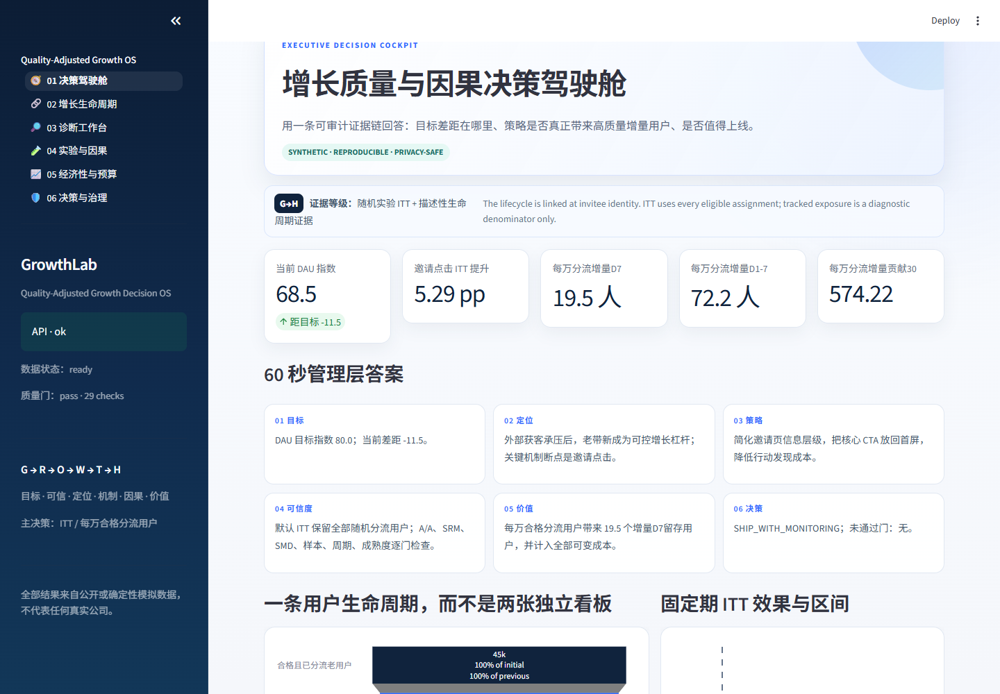
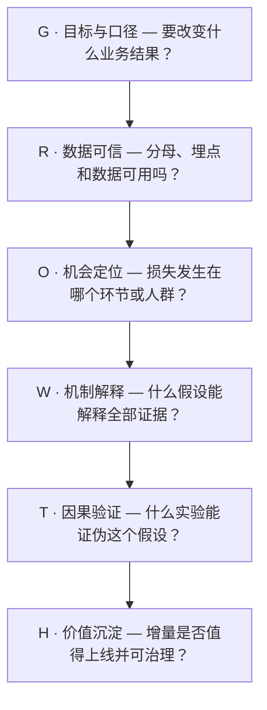
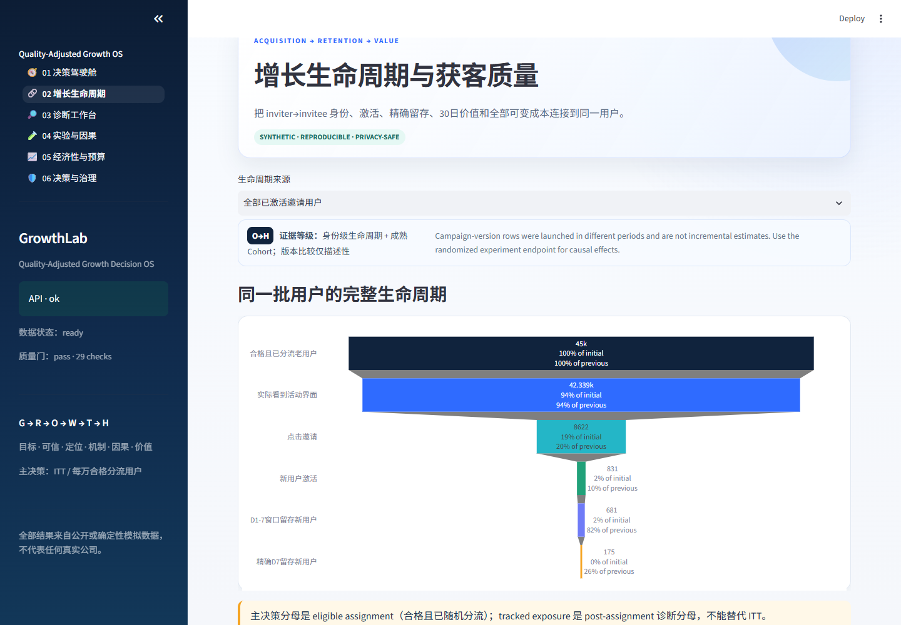
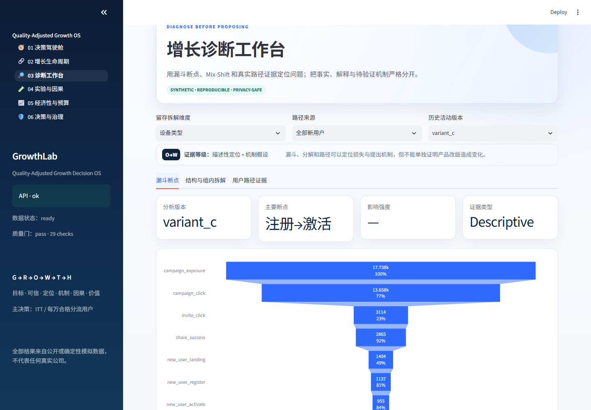
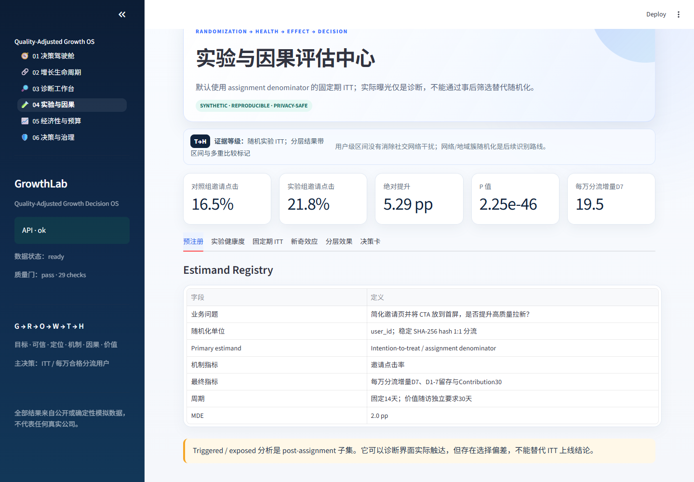
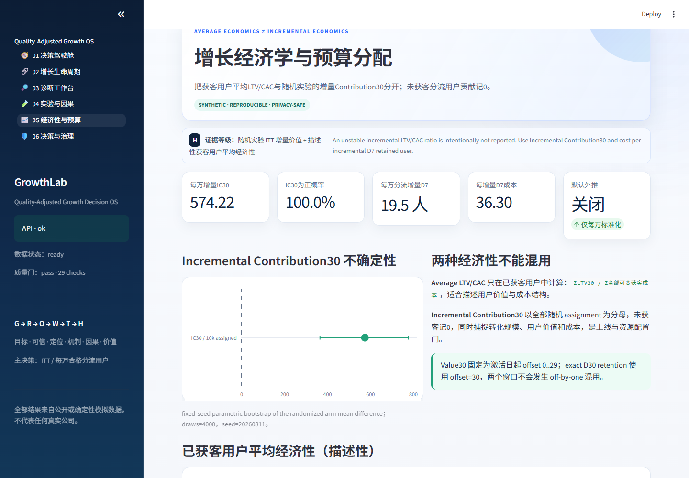
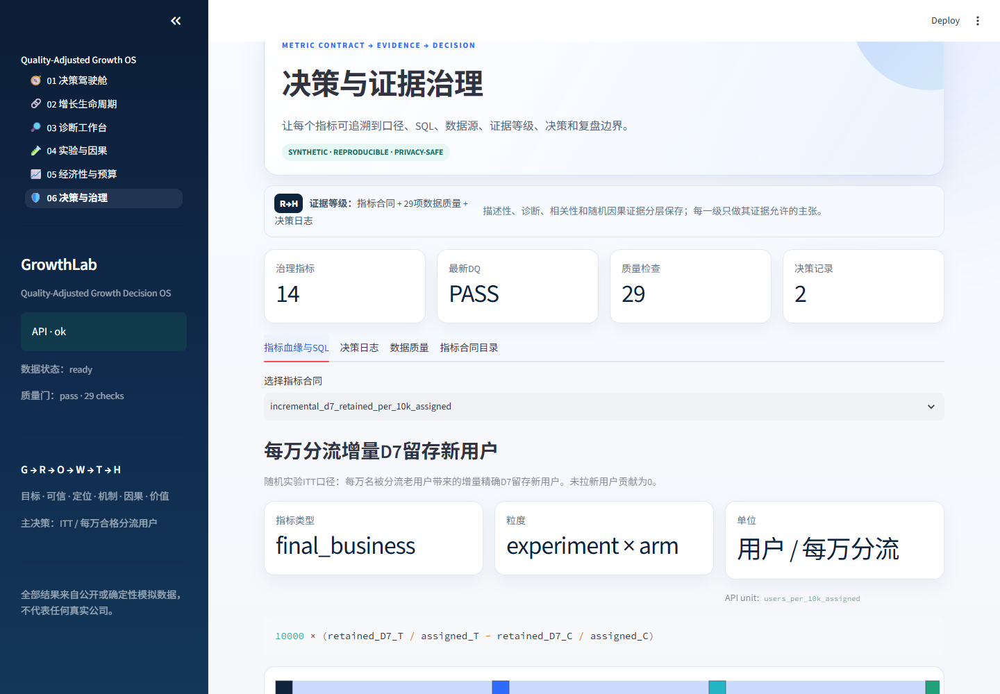
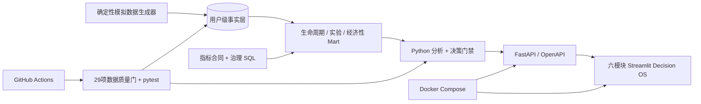

# GrowthLab — 质量校正增长决策系统

[](https://github.com/liu-XI71/growthlab-user-growth-analytics/actions/workflows/ci.yml)

[English](README.md) · [资深分析师 5 分钟审阅路线](docs/recruiter-review-guide_zh.md) · [GROWTH 分析方法论](docs/growth-methodology.md) · [指标字典](docs/metric-dictionary.md) · [实验方法论](docs/experimentation-guide.md) · [面试讲解指南](docs/interview-guide.md)

**GrowthLab 回答一个决策问题：**当外部获客供给承压时，老带新产品策略能否带来留得住、算得过账的增量用户？需要什么证据才值得上线？

项目不再把“老带新获客”和“新用户留存”做成两张互不相干的看板，而是贯通为一条可审计用户生命周期：分流 → 曝光 → 点击 → 获客 → 活跃 → 留存 → 价值 → 可变成本。它虽然拥有完整前后端和数据库，但首要展示的是分析能力：定义正确指标、定位业务机制、用实验验证、计算增量价值、治理最终决策。

> 本项目是独立作品集复现。公开演示中的用户、活动、金额、指标值与实验结果均为确定性模拟数据或标准化数值；不包含任何雇主内部数据、内部代码、生产凭证或保密标识。详见 [DISCLAIMER.md](DISCLAIMER.md)。

## 资深分析师 60 秒看什么

| 审阅问题 | GrowthLab 的回答 |
| --- | --- |
| **业务目标是什么？** | 在标准化 DAU 目标存在差距时，通过高质量获客补充增长，而不是只追求点击或安装量。 |
| **指标如何拆解？** | 业务结果 → 获客数量 → 用户质量 → 增量价值 → 安全与数据可信护栏。 |
| **可控断点在哪里？** | 漏斗和版本证据定位邀请点击率；Mix-Shift 与 Cohort 证据独立解释获客质量压力。 |
| **哪些是描述、哪些是因果？** | 活动版本趋势和分层分解用于提出假设；固定周期、assignment 口径的 ITT 实验支撑上线结论。 |
| **什么结果才值得上线？** | 统计显著、业务显著、下游质量成熟、增量 Contribution30 为正，并且预注册决策门全部通过。 |
| **沉淀了什么？** | 指标合同、诊断备忘录、实验预注册/健康清单、带监控和回滚条件的决策卡。 |



## GROWTH 业务决策框架

框架围绕六个业务问题组织，而不是围绕六项技术组织：



两个案例由此成为一套体系：老带新决定增长的**数量**，新用户留存决定增长的**质量**，Contribution30 与护栏决定这部分数量是否真正算作**增长**。

## 指标体系：从业务目标到上线决策

| 指标层级 | 决策目的 | 治理指标 | 避免的错误 |
| --- | --- | --- | --- |
| **业务结果层** | 是否真正缩小增长差距？ | 标准化 DAU 指数；增量高质量活跃用户 | 围绕单个页面指标做局部优化 |
| **获客数量层** | 合格流量在哪一步流失？ | 合格曝光 UV → 邀请点击率 → 分享成功 → 获客 → 激活 | 把点击或安装直接当成最终价值 |
| **用户质量层** | 获客是否形成持续使用？ | exact D1/D7/D30；成熟 D1–7 活跃窗口；来源/设备 Cohort 质量 | 用低留存流量购买表面增长 |
| **增量价值层** | 策略是否创造了超过成本的价值？ | 每万分流增量 D7；每万分流 Contribution30；每位增量 D7 成本 | 把平均 ROI 与因果增量混为一谈 |
| **护栏与可信层** | 结论是否安全、可信？ | 平均 LTV/CAC 护栏；样本与成熟度；DQ；SRM；SMD；分层耐久性 | 在埋点异常、人群失衡或结果未成熟时上线 |

每个指标都明确资格条件、粒度、分子、分母、观察窗口、成熟度、负责人、SQL 血缘和结论边界，详见[指标字典](docs/metric-dictionary.md)。

## 这套项目展示了什么分析能力

项目不只展示“会画图”，而是集中证明数据分析岗位真正需要的能力：

- **一个生命周期、一套用户粒度**：实验拉来的新用户是真实用户行，后续活跃、留存、价值与成本复用同一身份，不拼接互不相关的汇总数；
- **决策优先的指标治理**：每个指标都有资格口径、分母、观察窗口、负责人、SQL 血缘、更新 SLA 与结论边界；
- **先定位、后提策略**：用漏斗、路径、Cohort、Mix-Shift 与辛普森风险先确认问题在哪里，再提出产品机制假设；
- **默认 ITT 的因果纪律**：主结论保留全部随机分流用户，实际曝光/Triggered 只作诊断，并显式提示选择偏差；
- **先检查实验健康，再看 p 值**：Hash 分流、A/A、SRM、实验前 SMD、固定周期、样本量、成熟度、多重比较、业务 MDE 与护栏都是独立门禁；
- **质量校正增长**：同时输出每万分流用户的增量 D7 留存、增量 D1–7 活跃与计入全部可变成本后的 30 日增量贡献；
- **不混淆经济性分母**：平均 `LTV/CAC`、增量贡献、每个增量留存用户成本、盈亏平衡和预算情景分别定义；
- **可复用的分析操作系统**：每个案例最终都沉淀指标合同、证据链、决策卡、监控规则与回滚条件，而不是一次性汇报材料。

## 可复现的 10 万用户标准演示

默认 seed-42 标准库包含 100,000 个模拟用户。已知数据生成机制只有一条实验因果路径：新版邀请页改善可用性，从而增加获客数量；两组后续留存、价值、激励和可变成本政策完全相同，避免“为了得到好结果而给实验组更高质量用户”。

| 固定周期结果 | 标准模拟基准 |
| --- | ---: |
| 数据质量门 | 29 / 29 通过 |
| 邀请点击率 | 16.50% → 21.79%（+5.29 pp） |
| 每万分流增量 D7 留存 | 19.48 人（95% CI 8.00–30.96） |
| 每万分流增量 D1–7 活跃 | 72.19 人（95% CI 49.68–94.71） |
| 每万分流 30 日增量贡献 | 574.22（Bootstrap 95% CI 364.85–776.90） |
| 预注册决策门 | 12 / 12 通过 → `SHIP_WITH_MONITORING` |

以上全部是确定性模拟的作品集基准，不是任何雇主的真实业绩或业务预测。小样本会有意返回 `DO_NOT_SHIP`，直到样本、周期、成熟度、数据质量与经济性门槛全部满足。

## 六个决策模块

1. **决策驾驶舱**：用 60 秒管理层答案和 3 分钟 Guided Flow，从标准化 DAU 差距走到可审计上线结论；
2. **增长生命周期**：一条获客到价值链路、成熟 Cohort 分母、获客质量矩阵，以及描述性与因果结论边界；
3. **诊断工作台**：路径证据、版本断点、设备 Mix-Shift、辛普森风险，以及事实 → 解释 → 假设 → 行动 → 局限；
4. **实验与因果**：预注册、分流/曝光区分、A/A、SRM、SMD、周度耐久性、ITT/Triggered、分层区间、多重比较和决策门禁；
5. **经济性与预算**：平均单位经济性和增量经济性分开展示，覆盖 Bootstrap 不确定性、每个增量 D7 成本、盈亏平衡与预算情景；
6. **决策与治理**：指标合同、SQL 血缘、证据等级、数据质量、决策卡、负责人、监控规则与回滚条件。

<table>
  <tr>
    <td width="50%"><a href="docs/assets/growthlab-lifecycle.png"></a><br><b>生命周期：</b>同一用户身份贯通获客、留存与价值</td>
    <td width="50%"><a href="docs/assets/growthlab-investigation.png"></a><br><b>诊断：</b>断点、Mix-Shift 与负证据</td>
  </tr>
  <tr>
    <td width="50%"><a href="docs/assets/growthlab-experiment.png"></a><br><b>因果：</b>先检查实验健康，再解释 ITT 效果</td>
    <td width="50%"><a href="docs/assets/growthlab-economics.png"></a><br><b>经济性：</b>增量价值、不确定性与预算情景</td>
  </tr>
  <tr>
    <td width="50%"><a href="docs/assets/growthlab-governance.png"></a><br><b>治理：</b>指标血缘、责任人、监控与回滚</td>
    <td width="50%"><a href="docs/assets/growthlab-executive-cockpit.png"></a><br><b>管理层答案：</b>60 秒讲清目标、证据、价值与决策</td>
  </tr>
</table>

推荐按[资深分析师 5 分钟审阅路线](docs/recruiter-review-guide_zh.md)浏览，而不是从技术目录开始。

## 交付架构：它是证据，不是主角



## 完整实验流程

```text
目标策略与业务目的
  → 核心指标、最终业务指标、护栏指标、相关指标
  → 历史基线、MDE、显著性水平、功效、整周周期
  → 基于 user_id 的稳定 Hash 分流与 assignment/exposure 双日志
  → A/A 检查分流、口径与指标链路
  → 显式 SRM 与实验前渠道/城市/设备 SMD
  → 固定周期 A/B 执行
  → ITT 效应、置信区间、预设分层与多重比较策略
  → 样本 + 周期 + 成熟度 + 质量 + 统计 + 业务 + 护栏门
  → 增量留存 + Contribution30 + 经济性门
  → 监控上线 / 迭代 / 停止，并记录可审计原因
```

实验中心还覆盖新奇效应、网络效应、禁止中途偷看 P 值、辛普森悖论、分层不确定性、多重比较，以及无法随机化时 DID/PSM 的适用边界。完整说明见 [docs/experimentation-guide.md](docs/experimentation-guide.md)。

更上层的个人分析框架见 [GROWTH Decision OS](docs/growth-methodology.md)：目标与口径 → 可信度 → 机会定位 → 机制假设 → 因果验证 → 价值决策。它将 Google Research、Microsoft Research、Kitagawa 分解、官方 Cohort 定义与网络干扰研究连接到两个项目，同时明确每种方法“能说明什么、不能越界说明什么”。

## 快速运行

推荐使用 Docker：

```bash
docker compose up --build
```

首次启动会生成标准 10 万用户数据库，在普通笔记本上约需 3–4 分钟；Compose 已为后端设置 6 分钟健康检查启动保护期。

如果只想快速体验六个页面，可在 Windows PowerShell 运行：

```powershell
$env:GROWTHLAB_DEMO_USERS='5000'
docker compose up --build
```

Bash/zsh 可运行：

```bash
GROWTHLAB_DEMO_USERS=5000 docker compose up --build
```

5 千用户配置可以完整体验功能，但会因为未达到预注册最小样本量而保守返回 `DO_NOT_SHIP`，这是预期行为。

运行后访问：

- 业务前端：`http://localhost:8501`
- API 文档：`http://localhost:8000/docs`
- 健康检查：`http://localhost:8000/health`

本地运行支持 Python 3.10–3.13：

```bash
python -m venv .venv
# Windows: .venv\Scripts\activate
# macOS/Linux: source .venv/bin/activate
python -m pip install -e ".[dev]"
python -m scripts.generate_demo_data
uvicorn backend.main:app --reload
```

另开终端：

```bash
streamlit run frontend/streamlit_app.py
```

测试与代码检查：

```bash
pytest --cov=analytics --cov=backend --cov-report=term-missing
ruff check .
```

## 面试时怎么讲

不要从技术栈开始。建议按以下顺序：

1. 我先把模糊的增长目标拆成能定位问题的指标体系；
2. 通过漏斗/分层/分解排除哪些原因，留下哪个关键假设；
3. 如何把假设转成有 MDE、样本量、护栏和分流检查的实验；
4. 为什么既看统计显著，也看业务显著和单位经济性；
5. 为了让结论可复现，我把口径封装进 SQL、API、测试和数据质量检查；
6. 最后主动说明数据限制、相关性边界和下一轮迭代。

更完整的三分钟与十分钟版本见 [docs/interview-guide.md](docs/interview-guide.md)。

## 项目结构

```text
analytics/     生命周期、诊断、实验、经济性与决策逻辑
backend/       FastAPI 路由、数据模型、数据库访问和服务编排
frontend/      六模块 Streamlit 决策应用
sql/           数据仓库结构及生命周期/实验/经济性/治理 Mart
scripts/       可复现模拟数据生成及辅助命令
tests/         金标准、反向用例、数据质量、API、UI 与集成测试
docs/          案例、指标字典、数据卡、实验与面试指南
.github/       持续集成工作流
```

## 案例文档

- [老带新增长：漏斗诊断、产品迭代、实验设计与单位经济性](docs/case-study-referral.md)
- [新用户留存：分层、路径排除、功能假设与因果验证](docs/case-study-retention.md)

案例均为通用分析方法的模拟作品集复现，采用“问题—证据—决策—局限”的表达，不将模拟结果包装成任何具体公司的真实商业成绩。

## 许可

代码采用 [MIT License](LICENSE)。第三方公共数据仍遵循其原始许可和使用条款。
