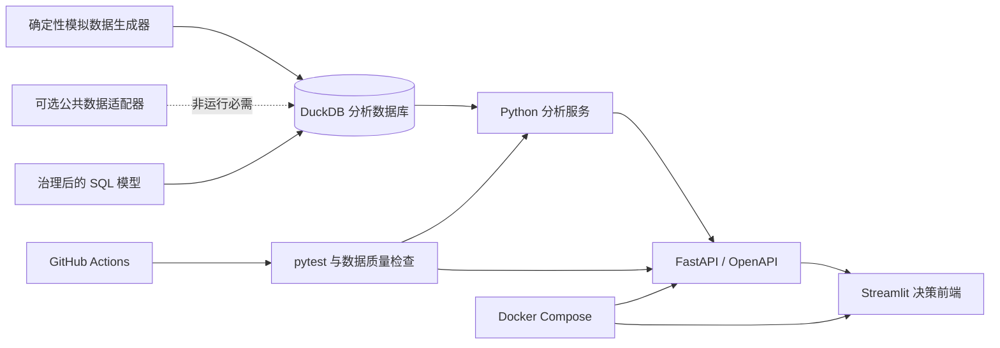

# GrowthLab — 用户增长分析与实验评估工作台

[](https://github.com/liu-XI71/growthlab-user-growth-analytics/actions/workflows/ci.yml)

[English](README.md) · [GROWTH 分析方法论](docs/growth-methodology.md) · [指标字典](docs/metric-dictionary.md) · [实验方法论](docs/experimentation-guide.md) · [面试讲解指南](docs/interview-guide.md)

GrowthLab 是一个面向数据分析、用户增长与商业分析岗位的端到端作品集项目。它将“老带新获客”和“新用户留存”两类典型问题，落地为一套可运行、可解释、可检验、可公开的分析系统：从指标体系、SQL 和 DuckDB 数据库，到 FastAPI 后端、九页 Streamlit 前端、完整 A/A 与 A/B 实验评估、自动化测试、Docker 和 GitHub Actions。

> 本项目是独立作品集复现。公开演示中的用户、活动、金额、指标值与实验结果均为确定性模拟数据或标准化数值；不包含任何雇主内部数据、内部代码、生产凭证或保密标识。详见 [DISCLAIMER.md](DISCLAIMER.md)。

## 为什么它比普通看板更有含金量

项目不只展示“会画图”，而是集中证明数据分析岗位真正需要的能力：

- 将增长目标拆解成定义清晰、口径可治理的指标树；
- 用漏斗定位变化发生在哪个环节，再形成产品假设；
- 将留存变化拆成用户结构变化和分层内部表现变化；
- 明确区分功能使用相关性与实验因果性；
- 在看结果之前完成实验目标、指标、MDE、样本量和周期设计；
- 实现稳定 Hash 分流、A/A、SRM、人群均衡、辛普森悖论检查和分层结果；
- 同时判断置信区间、统计显著性、业务显著性与护栏指标；
- 明确区分 `LTV/CAC` 和净 ROI，并提供敏感性分析；
- 让同一套分析逻辑可以通过 SQL、Python、API 和业务前端复用；
- 用测试、数据质量检查、Docker 与 CI 保证结果可以复现。

## 九个业务页面

1. **经营总览**：标准化 DAU 目标进度、稳健异常排查、增长来源贡献、指标树和 KPI。
2. **GROWTH 方法论**：六阶段个人分析操作系统、六级证据阶梯、权威来源与结论边界。
3. **通用分析工作台**：问题路由、可编辑聚合漏斗、Mix-Shift 分解和结论备忘录。
4. **数据质量与治理**：自动完整性闸门、指标合同、可复现性和公开隐私边界。
5. **老带新漏斗**：不同策略版本对比、转化诊断、证据—解释—假设—行动链路。
6. **ROI 与 LTV**：首月价值、CAC、LTV/CAC、净 ROI、基准对比和敏感性分析。
7. **留存诊断**：Cohort 热力图、精确日/窗口留存、分层、结构—表现分解和上手漏斗。
8. **功能分析**：标杆用户功能渗透差异，同时明确“相关不等于因果”。
9. **实验中心**：预注册、Hash 分流、A/A、SRM、均衡性、A/B、显著性与上线决策。

## 核心架构



## 完整实验流程

```text
目标策略与业务目的
  → 核心指标、最终业务指标、护栏指标、相关指标
  → 历史基线、MDE、显著性水平、功效、整周周期
  → 基于 user_id 的稳定 Hash 分流
  → A/A 检查分流、口径与埋点
  → SRM 与渠道/城市/设备人群均衡
  → 固定周期 A/B 执行
  → 两比例 Z 检验与差值置信区间
  → 统计显著 + 业务显著 + 护栏通过
  → 上线 / 迭代 / 停止，并记录可审计原因
```

实验中心还覆盖新奇效应、网络效应、禁止中途偷看 P 值、辛普森悖论和无法随机化时 DID/PSM 的适用边界。完整说明见 [docs/experimentation-guide.md](docs/experimentation-guide.md)。

更上层的个人分析框架见 [GROWTH Decision OS](docs/growth-methodology.md)：目标与口径 → 可信度 → 机会定位 → 机制假设 → 因果验证 → 价值决策。它将 Google Research、Microsoft Research、Kitagawa 分解、官方 Cohort 定义与网络干扰研究连接到两个项目，同时明确每种方法“能说明什么、不能越界说明什么”。

## 快速运行

推荐使用 Docker：

```bash
docker compose up --build
```

运行后访问：

- 业务前端：`http://localhost:8501`
- API 文档：`http://localhost:8000/docs`
- 健康检查：`http://localhost:8000/health`

本地运行支持 Python 3.10–3.13：

```bash
python -m venv .venv
# Windows: .venv\Scripts\activate
# macOS/Linux: source .venv/bin/activate
python -m pip install -e ".[dev]"
python -m scripts.generate_demo_data
uvicorn backend.main:app --reload
```

另开终端：

```bash
streamlit run frontend/streamlit_app.py
```

测试与代码检查：

```bash
pytest --cov=analytics --cov=backend --cov-report=term-missing
ruff check .
```

## 面试时怎么讲

不要从技术栈开始。建议按以下顺序：

1. 我先把模糊的增长目标拆成能定位问题的指标体系；
2. 通过漏斗/分层/分解排除哪些原因，留下哪个关键假设；
3. 如何把假设转成有 MDE、样本量、护栏和分流检查的实验；
4. 为什么既看统计显著，也看业务显著和单位经济性；
5. 为了让结论可复现，我把口径封装进 SQL、API、测试和数据质量检查；
6. 最后主动说明数据限制、相关性边界和下一轮迭代。

更完整的三分钟与十分钟版本见 [docs/interview-guide.md](docs/interview-guide.md)。

## 项目结构

```text
analytics/     指标、漏斗、留存、ROI、分解与实验统计逻辑
backend/       FastAPI 路由、数据模型、数据库访问和服务编排
frontend/      九页 Streamlit 业务分析应用
sql/           数据仓库表结构与治理后的分析 SQL
scripts/       可复现模拟数据生成及辅助命令
tests/         单元、统计、集成、API 与数据质量测试
docs/          案例、指标字典、数据卡、实验与面试指南
.github/       持续集成工作流
```

## 案例文档

- [老带新增长：漏斗诊断、产品迭代、实验设计与单位经济性](docs/case-study-referral.md)
- [新用户留存：分层、路径排除、功能假设与因果验证](docs/case-study-retention.md)

案例均为通用分析方法的模拟作品集复现，采用“问题—证据—决策—局限”的表达，不将模拟结果包装成任何具体公司的真实商业成绩。

## 许可

代码采用 [MIT License](LICENSE)。第三方公共数据仍遵循其原始许可和使用条款。
