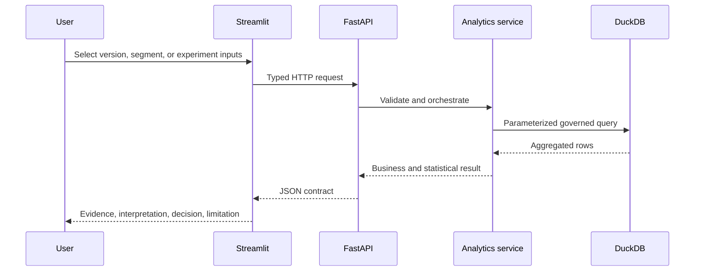

# Architecture and request flow

## Design goal

GrowthLab is intentionally small enough to run on a laptop but structured like a production analytics product. Metric definitions and statistical logic live outside the UI so that a chart cannot silently redefine a business metric.

## Layers

| Layer | Responsibility | Anti-pattern avoided |
|---|---|---|
| `sql/` | Schema and governed aggregation logic | Metric definitions hidden inside chart code |
| `analytics/` | Pure analytical and statistical functions | UI-dependent calculations that cannot be tested |
| `backend/` | Validation, persistence, orchestration, OpenAPI | Frontend connecting directly to database tables |
| `frontend/` | Decision-oriented presentation | Dashboard as an unexplained wall of charts |
| `tests/` | Gold cases, contracts, invariants, data quality | Treating a successful render as analytical correctness |

## Deployment topology

Docker Compose starts one API container and one Streamlit container. DuckDB is appropriate for the public single-node demo; a production deployment would replace it with a governed warehouse, use an orchestrator for incremental models, add authentication/authorization, central logging, observability, secrets management, and a managed experiment registry.

## Privacy boundary

The repository does not need production exports to tell the analytical story. The generator creates stable fictional IDs, coherent user journeys, segments, cohorts, and experiment outcomes. Monetary fields use normalized units. The optional public-data path is isolated from the default build, and raw external data is not redistributed.
