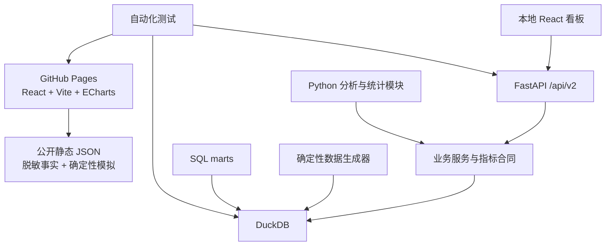

# V2 架构：为业务叙事服务的完整前后端

## 设计原则

技术架构只解决三件事：招聘官无需安装即可看、指标不能被图表偷偷改口径、所有结论能够自动复核。

## 六个页面

| 页面 | 首要业务问题 | 主要图表 | 希望证明的能力 |
|---|---|---|---|
| 业务总览 | 两段经历有什么共同方法？ | KPI、案例链路、分析闭环、能力雷达 | 把经历沉淀成方法论 |
| 老带新增长 | 为什么裂变率上涨后仍要迭代？ | 指标树、版本趋势、推荐漏斗、实验卡、LTV/CAC | 从增长目标到经济决策 |
| 新用户留存 | 用户为什么留不住？ | Cohort 趋势、设备率与占比、路径、功能渗透、实验卡 | 分层、负证据、相关到因果 |
| 实验中心 | 结果能不能被相信？ | SOP 时间线、预注册卡、可信度检查、结果对比 | 实验设计与判断边界 |
| 价值与渠道 | 显著后值不值得？ | LTV/CAC 对比、激励指数、价值公式 | 单位经济性与渠道比较 |
| 指标治理 | 结论能否复核？ | 指标合同、证据阶梯、决策记录 | 口径、边界、治理沉淀 |

## 双模式数据访问

### GitHub Pages

前端默认读取 `web/public/data/portfolio.json`。该文件由 Python 数据合同确定性导出，因此在线作品集不依赖服务器，招聘官点击链接即可访问。

### 本地完整模式

Docker Compose 启动 FastAPI、DuckDB 与 Nginx 托管的 React 页面。`/api/v2` 提供与静态数据包同构的业务接口，同时保留原有统计、生命周期与经济性分析接口。

## 数据分层

| 类型 | 示例 | 页面表达 |
|---|---|---|
| 脱敏项目事实 | 17%→23.5%、48%→41%、2.18 vs 1.90 | 明确标“项目叙述” |
| 标准化事实 | DAU 81.25/100、激励指数100→160 | 隐去真实规模与金额 |
| 确定性模拟明细 | 漏斗UV、Cohort日趋势、非核心功能值 | 明确标“演示数据” |
| 待确认口径 | 裂变率唯一分母、标杆时长阈值 | 显示治理状态，不补造 |

## 为什么保留 DuckDB 与分析模块

- DuckDB 让完整数据层能够在笔记本和 CI 上真实运行；
- SQL Mart 把用户、邀请、留存、价值和成本统一到可审计粒度；
- Python 分析模块验证分层、Mix Shift、实验、置信区间与经济性；
- FastAPI 让页面不直接读取数据库，也不能在前端静默重定义指标；
- 测试同时检查业务数字、统计边界、API 和 UI。

这不是生产级权限系统。真实公司部署仍需数仓、调度、鉴权、行列权限、日志、监控和密钥管理；公开作品集不假装已经具备这些企业基础设施。
