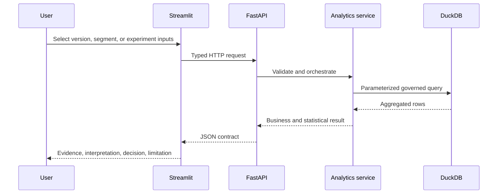
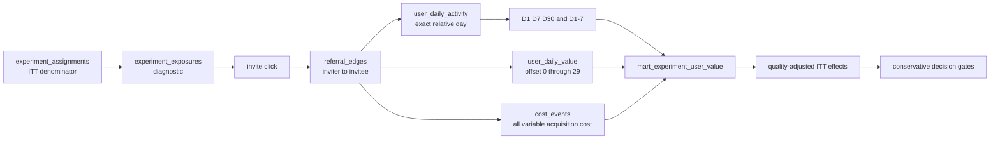

# Architecture and request flow

## Design goal

GrowthLab is intentionally small enough to run on a laptop but structured like a production analytics product. Metric definitions and statistical logic live outside the UI so that a chart cannot silently redefine a business metric.

## Layers

| Layer | Responsibility | Anti-pattern avoided |
|---|---|---|
| `sql/` | Schema and governed aggregation logic | Metric definitions hidden inside chart code |
| `analytics/` | Pure analytical and statistical functions | UI-dependent calculations that cannot be tested |
| `backend/` | Validation, persistence, orchestration, OpenAPI | Frontend connecting directly to database tables |
| `frontend/` | Decision-oriented presentation | Dashboard as an unexplained wall of charts |
| `tests/` | Gold cases, contracts, invariants, data quality | Treating a successful render as analytical correctness |

## Deployment topology

Docker Compose starts one API container and one Streamlit container. DuckDB is appropriate for the public single-node demo; a production deployment would replace it with a governed warehouse, use an orchestrator for incremental models, add authentication/authorization, central logging, observability, secrets management, and a managed experiment registry.

## Privacy boundary

The repository does not need production exports to tell the analytical story. The generator creates stable fictional IDs, coherent user journeys, segments, cohorts, and experiment outcomes. Monetary fields use normalized units. The optional public-data path is isolated from the default build, and raw external data is not redistributed.

## Quality-adjusted lifecycle spine

Version 2 replaces two disconnected case tables with one canonical invitee identity. `referral_edges.new_user_id` is the invitee's `users.user_id`; the same identifier must appear in activity, retention, value and variable-cost facts.

The main analytical views are:

| View | Grain | Decision purpose |
|---|---|---|
| `mart_user_lifecycle` | activated referral edge | Trace one invitee from acquisition to retention and value |
| `mart_acquisition_quality` | source × campaign × treatment label | Descriptive quality and average acquired-user economics |
| `mart_experiment_user_value` | assignment user × experiment | Primary ITT fact; non-acquired assignments contribute zero |
| `mart_experiment_effects_itt` | experiment × arm | Reconciled arm counts and value totals |

## Six decision modules

The UI is intentionally organized by decision, not by chart type:

1. Executive Decision Cockpit;
2. Growth Lifecycle;
3. Investigation Studio;
4. Experiment & Causal Lab;
5. Growth Economics & Allocation;
6. Decision & Governance.

Each module declares its GROWTH gate, evidence level and claim boundary. Descriptive campaign-version comparisons never receive an `incremental` or `causal` label. Randomized effects default to assignment-denominator ITT; exposed-user rates are explicitly post-assignment diagnostics.

## API contracts added in version 2

| Route family | Contract |
|---|---|
| `/lifecycle/*` | linked lifecycle, mature cohorts and descriptive acquisition quality |
| `/investigation/*` | mix-shift and path evidence without causal overclaiming |
| `/experiments/{id}/health` | assignment→exposure→observable, SRM and pre-treatment one-hot SMD |
| `/experiments/{id}/effects` | fixed-horizon ITT, CI, durability slices, segment multiplicity and decision gates |
| `/economics/*` | average versus incremental economics, uncertainty and normalized budget scenarios |
| `/decisions` | persisted Fact→Interpretation→Hypothesis→Action→Limitation records |
| `/metrics/{name}/lineage` | metric contract, source, mart, SQL evidence and decision use |
